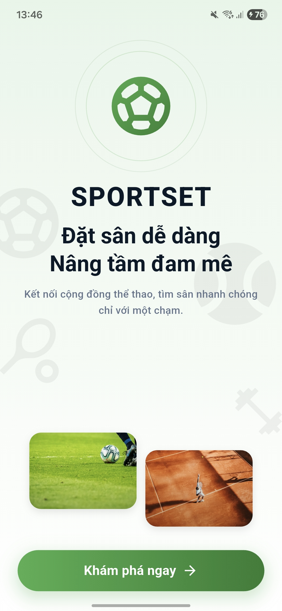
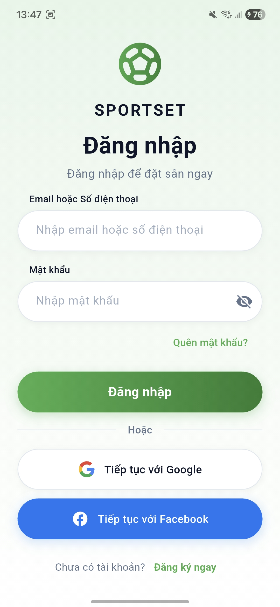
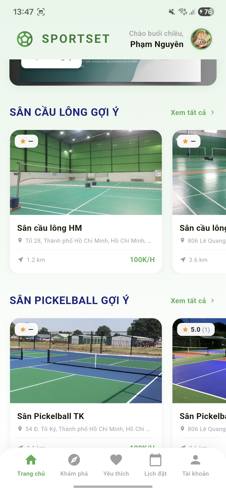
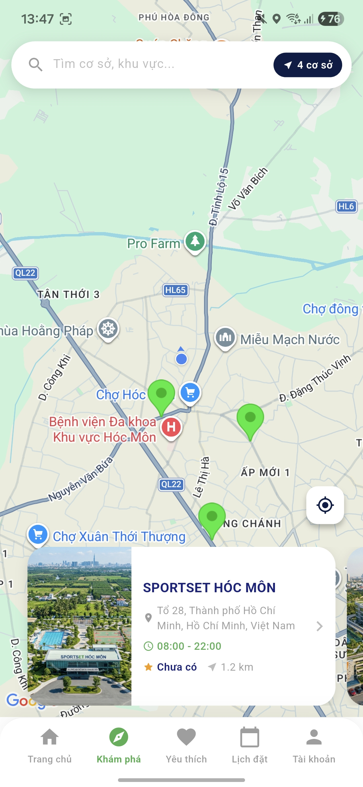
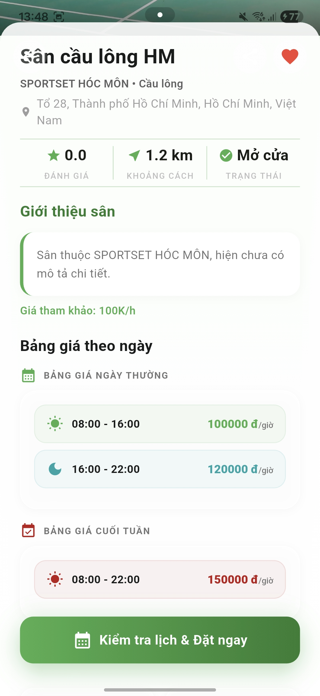
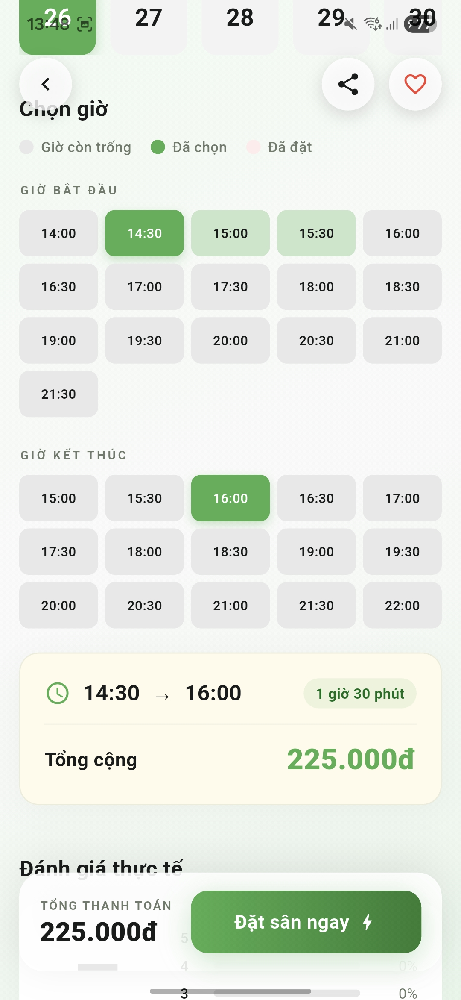
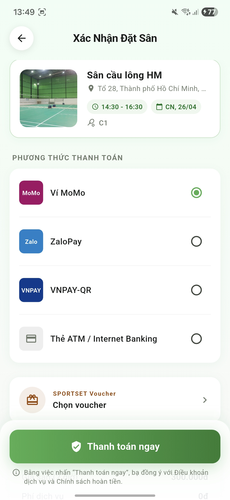
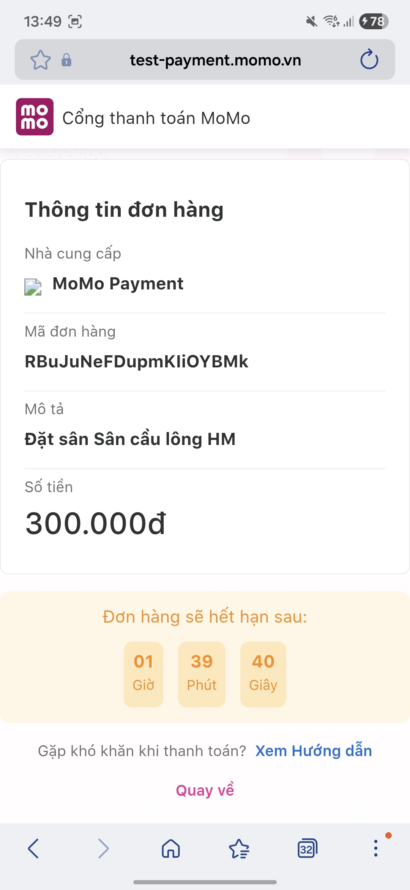
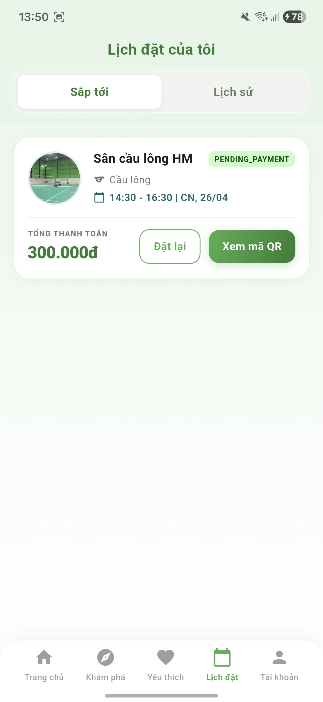

# 🏟️ Sportset Customer

Ứng dụng đặt sân thể thao thông minh dành cho người dùng

[](https://flutter.dev)
[](https://firebase.google.com)
[](https://dart.dev)
[](LICENSE)

Tìm kiếm · Đặt sân · Thanh toán — chỉ trong một ứng dụng

---

## 📖 Giới thiệu

**Sportset Customer** là ứng dụng di động (Flutter) giúp người dùng dễ dàng **tìm kiếm**, **đặt sân thể thao** và **thanh toán** ngay trên điện thoại. Ứng dụng hỗ trợ nhiều loại sân (bóng đá, cầu lông, tennis, ...), tích hợp bản đồ Google Maps để hiển thị sân gần nhất, và kết nối ví điện tử MoMo để thanh toán nhanh chóng.

> 🗺️ Mặc định hiển thị các sân trong bán kính **15 km** tại khu vực **TP. Hồ Chí Minh**.

---

## ✨ Tính năng nổi bật

| Nhóm tính năng | Chi tiết |
| --- | --- |
| 🔐 **Xác thực** | Đăng ký / Đăng nhập Email, Google, Facebook · OTP · Quên mật khẩu |
| 🗺️ **Khám phá** | Bản đồ Google Maps · Danh sách sân theo khoảng cách · Tìm kiếm gợi ý |
| 📅 **Đặt sân** | Chọn ngày 7 ngày tới · Chọn giờ / sân phụ · Áp mã voucher |
| 💳 **Thanh toán** | Ví MoMo (sandbox) · Deep-link kết quả thanh toán |
| ❤️ **Yêu thích** | Lưu sân yêu thích · Xem lại nhanh |
| 📋 **Lịch sử** | Booking sắp tới & đã qua · Xem QR code booking |
| ⭐ **Đánh giá** | Viết nhận xét & chấm sao sau khi hoàn thành đặt sân |
| 👤 **Hồ sơ** | Chỉnh sửa thông tin · Ảnh đại diện · Cài đặt · Thông báo |

---

## 🖼️ Giao diện ứng dụng

| Onboarding | Đăng nhập | Trang chủ |
| :---: | :---: | :---: |
|  |  |  |

| Bản đồ | Chi tiết sân | Đặt sân |
| :---: | :---: | :---: |
|  |  |  |

| Xác nhận đặt sân | Thanh toán MoMo | Lịch sử booking |
| :---: | :---: | :---: |
|  |  |  |

---

## 🛠️ Công nghệ sử dụng

### Core

- **[Flutter](https://flutter.dev)** 3.10.3+ — Framework đa nền tảng (Android · iOS · Web · Desktop)
- **[Dart](https://dart.dev)** — Ngôn ngữ lập trình
- **Material Design 3** — Hệ thống thiết kế UI
- **Font:** Lexend · Màu chủ đạo: `#4CAF50` (xanh lá)

### Firebase

| Dịch vụ | Mục đích |
| --- | --- |
| Firebase Auth | Xác thực người dùng |
| Cloud Firestore | CSDL thời gian thực |
| Firebase Storage | Lưu trữ ảnh đại diện |

### Thư viện chính

```yaml
# Bản đồ & Vị trí
google_maps_flutter: ^2.9.0
geolocator: ^13.0.2

# Xác thực xã hội
google_sign_in: ^6.2.2
flutter_facebook_auth: ^7.1.1

# Thanh toán MoMo (custom service)
url_launcher: ^6.3.1
crypto: ^3.0.3          # HMAC-SHA256 signature

# Tiện ích
image_picker: ^1.1.0
qr_flutter: ^4.1.0
shared_preferences: ^2.3.3
app_links: ^6.0.0       # Deep linking
http: ^1.2.0
```

---

## 🗂️ Cấu trúc thư mục

```
sportset_customer/
├── lib/
│   ├── main.dart                        # Entry point & routing
│   ├── firebase_options.dart            # Cấu hình Firebase
│   ├── screens/
│   │   ├── intro/                       # Màn hình giới thiệu
│   │   ├── auth/                        # Đăng nhập · Đăng ký · OTP · Quên MK
│   │   ├── home/                        # Trang chủ · Tìm kiếm
│   │   ├── explore/                     # Bản đồ · Danh sách sân
│   │   ├── field_detail/                # Chi tiết sân
│   │   ├── booking/                     # Luồng đặt sân & voucher
│   │   ├── booking_history/             # Lịch sử & đánh giá
│   │   ├── favorites/                   # Sân yêu thích
│   │   ├── profile/                     # Hồ sơ & cài đặt
│   │   └── payment/                     # Thanh toán & kết quả
│   └── services/
│       └── momo_service.dart            # Tích hợp MoMo API
├── android/
├── ios/
├── pubspec.yaml
└── README.md
```

---

## 🚀 Cài đặt & Chạy dự án

### Yêu cầu

- [Flutter SDK](https://docs.flutter.dev/get-started/install) `>= 3.10.3`
- [Dart SDK](https://dart.dev/get-dart) `>= 3.0.0`
- Android Studio / Xcode (để chạy emulator/simulator)
- Tài khoản Firebase
- Google Maps API Key
- Tài khoản MoMo Developer (nếu test thanh toán)

### 1. Clone dự án

```bash
git clone https://github.com/<your-username>/sportset_customer.git
cd sportset_customer
```

### 2. Cài đặt dependencies

```bash
flutter pub get
```

### 3. Cấu hình Firebase

1. Tạo project tại [Firebase Console](https://console.firebase.google.com)
2. Thêm app Android / iOS
3. Tải file cấu hình:
   - Android: `google-services.json` → đặt vào `android/app/`
   - iOS: `GoogleService-Info.plist` → đặt vào `ios/Runner/`
4. Chạy FlutterFire CLI để tạo `firebase_options.dart`:

```bash
dart pub global activate flutterfire_cli
flutterfire configure
```

### 4. Cấu hình Google Maps

Thêm API Key vào `android/app/src/main/AndroidManifest.xml`:

```xml
<meta-data
    android:name="com.google.android.geo.API_KEY"
    android:value="YOUR_GOOGLE_MAPS_API_KEY"/>
```

### 5. Chạy ứng dụng

```bash
# Kiểm tra thiết bị kết nối
flutter devices

# Chạy ở chế độ debug
flutter run

# Build APK release
flutter build apk --release
```

---

## 🔄 Luồng hoạt động chính

```
Người dùng mở app
      │
      ▼
  [Intro Screen]
      │
      ▼
  [Đăng nhập / Đăng ký]  ←──  Google / Facebook / Email
      │
      ▼
  [Home Screen]  ─────────────────────────────────┐
      │                                            │
      ▼                                            ▼
  [Explore / Map]                           [Tìm kiếm]
      │
      ▼
  [Chi tiết Sân]
      │
      ▼
  [Chọn ngày · giờ · sân phụ]
      │
      ▼
  [Áp Voucher]
      │
      ▼
  [Xác nhận Booking]
      │
      ▼
  [Thanh toán MoMo]  ──→  [Deep Link kết quả]
      │
      ▼
  [Booking thành công]  ──→  [Lịch sử · QR Code · Đánh giá]
```

---

## 📊 Cơ sở dữ liệu Firestore

```
Firestore
├── customers/          # Thông tin người dùng
│   └── {uid}/
├── facilities/         # Cơ sở thể thao
│   └── {facilityId}/
├── courts/             # Sân (thuộc facility)
│   └── {courtId}/
├── bookings/           # Lịch đặt sân
│   └── {bookingId}/
└── reviews/            # Đánh giá & xếp hạng
    └── {reviewId}/
```

---

## 💳 Tích hợp thanh toán MoMo

Ứng dụng sử dụng **MoMo Payment Gateway** (môi trường sandbox) với luồng:

1. Tạo yêu cầu thanh toán → gọi API MoMo
2. Redirect người dùng đến app MoMo (qua `url_launcher`)
3. MoMo callback deep link `yourapp://payment-result`
4. Xử lý kết quả và cập nhật trạng thái booking

> ⚠️ Hiện tại chạy trên **môi trường test** (`test-payment.momo.vn`). Cần thay endpoint cho production.

---

## 🔐 Xác thực người dùng

| Phương thức | Mô tả |
| --- | --- |
| Email / Password | Đăng ký với xác minh email |
| Google Sign-In | OAuth 2.0 qua Google |
| Facebook Login | OAuth qua Facebook App |
| OTP | Xác minh số điện thoại |
| Forgot Password | Reset qua Firebase email link |

---

## 📱 Nền tảng hỗ trợ

| Nền tảng | Trạng thái |
| --- | --- |
| ✅ Android | Được hỗ trợ đầy đủ |
| ✅ iOS | Được hỗ trợ đầy đủ |
| 🔶 Web | Hỗ trợ cơ bản |
| 🔶 Windows | Hỗ trợ cơ bản |
| 🔶 macOS | Hỗ trợ cơ bản |

---

## 👥 Tác giả

| Tên | Vai trò |
| --- | --- |
| **Pham Nguyen** | Mobile Developer |

---

**Sportset Customer** — Đặt sân dễ dàng, trải nghiệm thể thao tuyệt vời 🏆

Made with Flutter & Firebase
